#### Complexity Analysis (Time and Space Complexity)

Complexity analysis is a technique to analyze the efficiency of an algorithm. It helps us to understand how the time and space requirements of an algorithm grow with the input size. Time complexity measures the amount of time an algorithm takes to run, while space complexity measures the amount of memory an algorithm uses. Both time and space complexity are commonly expressed using the big O notation. By analyzing the complexity of an algorithm, we can determine its efficiency and make informed decisions about its performance.

---

#### Types of Time Complexity

- Constant Time: O(1)
- Logarithmic Time: O(log n)
- Linear Time: O(n)
- Linearithmic Time: O(n log n)
- Quadratic Time: O(n^2)
- Cubic Time: O(n^3)
- Exponential Time: O(2^n)
- Factorial Time: O(n!)

#### Types of Space Complexity

- Constant Space: O(1)
- Linear Space: O(n)
- Quadratic Space: O(n^2)
- Cubic Space: O(n^3)
- Exponential Space: O(2^n)
- Factorial Space: O(n!)

#### Graphical Representation of Time Complexity

```graphviz
digraph G {
    rankdir=LR;
    node [shape=record];
    ConstantTime [label="Constant Time: O(1)"];
    LogarithmicTime [label="Logarithmic Time: O(log n)"];
    LinearTime [label="Linear Time: O(n)"];
    LinearithmicTime [label="Linearithmic Time: O(n log n)"];
    QuadraticTime [label="Quadratic Time: O(n^2)"];
    CubicTime [label="Cubic Time: O(n^3)"];
    ExponentialTime [label="Exponential Time: O(2^n)"];
    FactorialTime [label="Factorial Time: O(n!)"];
    ConstantTime -> LogarithmicTime -> LinearTime -> LinearithmicTime -> QuadraticTime -> CubicTime -> ExponentialTime -> FactorialTime;
}
```



#### Types of Time Complexity Notations

- Big O Notation: Describes the upper bound of an algorithm's time complexity.
- Big Theta Notation: Describes the average case time complexity of an algorithm.
- Big Omega Notation: Describes the lower bound of an algorithm's time complexity.
- Little O Notation: Describes the upper bound of an algorithm's time complexity excluding the exact bound.
- Little Omega Notation: Describes the lower bound of an algorithm's time complexity excluding the exact bound.
- Little Theta Notation: Describes the average case time complexity of an algorithm excluding the exact bound.

#### Big O Notation

Big O notation is a mathematical notation that describes the limiting behavior of a function when the argument tends towards a particular value or infinity. It is used to describe the upper bound of an algorithm's time complexity.

The following are some common time complexities and their corresponding big O notations:

- Constant Time: O(1)
- Logarithmic Time: O(log n)
- Linear Time: O(n)
- Linearithmic Time: O(n log n)
- Quadratic Time: O(n^2)
- Cubic Time: O(n^3)
- Exponential Time: O(2^n)
- Factorial Time: O(n!)

#### Big Theta Notation

Big Theta notation is used to describe the average case time complexity of an algorithm. It provides a tight bound on the growth rate of the algorithm's running time.

### Example

Consider the following code snippet:

```JavaScript
function sum(n) {
    let result = 0;
    for (let i = 1; i <= n; i++) {
        result += i;
    }
    return result;
}
```

The time complexity of this function is Θ(n) because the loop runs n times.

#### Big Omega Notation

Big Omega notation is used to describe the lower bound of an algorithm's time complexity. It provides a guarantee that the algorithm will not run slower than a certain rate.

### Example

Consider the following code snippet:

```JavaScript
function sum(n) {
    let result = 0;
    for (let i = 1; i <= n; i++) {
        result += i;
    }
    return result;
}
```

The time complexity of this function is Ω(1) because the loop will always run at least once.

#### Best, Worst, and Average Case Time Complexity

- Best Case Time Complexity: The minimum amount of time an algorithm takes to run on a given input.
- Worst Case Time Complexity: The maximum amount of time an algorithm takes to run on a given input.
- Average Case Time Complexity: The average amount of time an algorithm takes to run on a given input.

#### Asymptotic Analysis

Asymptotic analysis is a method of describing the limiting behavior of a function as the input size tends towards infinity. It is used to analyze the time complexity of an algorithm.

#### Time Complexity Classes

Time complexity classes are a set of categories that describe the growth rate of an algorithm's running time. Some common time complexity classes include:

- Polynomial Time: O(n^k) where k is a constant.
- Exponential Time: O(2^n)
- Factorial Time: O(n!)

---

#### Space Complexity

Space complexity is a measure of the amount of memory an algorithm uses as a function of the length of the input. It is also commonly expressed using the big O notation.

### Example

Consider the following code snippet:

```JavaScript
function sum(n) {
    let result = 0;
    for (let i = 1; i <= n; i++) {
        result += i;
    }
    return result;
}
```

The time complexity of this function is O(n) because the loop runs n times. The space complexity is O(1) because the amount of memory used by the algorithm does not depend on the input size.

#### Summary

- Complexity analysis helps us understand the efficiency of an algorithm in terms of time and space requirements.
- Time complexity measures the amount of time an algorithm takes to run as a function of the input size.
- Space complexity measures the amount of memory an algorithm uses as a function of the input size.
- Big O notation is used to describe the upper bound of an algorithm's time and space complexity.
