### Data Structures and Algorithms: From Basic to Advanced

#### Introduction

Data structures and algorithms are fundamental concepts in computer science that form the building blocks for designing efficient and scalable software systems. Understanding data structures and algorithms is essential for software developers, as they provide the tools and techniques to solve complex problems and optimize the performance of software applications.

This learning path covers a wide range of topics related to data structures and algorithms, starting from the basics and progressing to more advanced concepts. Whether you are a beginner looking to learn the fundamentals of data structures and algorithms or an experienced developer seeking to enhance your problem-solving skills, this path will provide you with the knowledge and skills needed to tackle a variety of programming challenges.

#### Prerequisites

To get the most out of this learning path, you should have a basic understanding of programming concepts and be familiar with at least one programming language such as Python, Java, C++, or JavaScript. While prior knowledge of data structures and algorithms is not required, having a strong foundation in programming will help you grasp the concepts more easily.

#### Learning Objectives

By completing this learning path, you will:

- Understand the importance of data structures and algorithms in software development.
- Learn how to analyze the efficiency of algorithms using time and space complexity analysis.
- Master the fundamental data structures such as arrays, linked lists, stacks, and queues.
- Explore intermediate data structures including trees, heaps, and graphs.
- Gain knowledge of advanced algorithms such as dynamic programming, greedy algorithms, and string algorithms.
- Develop problem-solving skills through hands-on coding exercises and projects.
- Apply data structures and algorithms to real-world scenarios and software development challenges.

#### Let's Get Started!

Are you ready to embark on a journey to master data structures and algorithms? Let's dive into the world of programming and problem-solving together! Start your learning journey today and unlock the power of data structures and algorithms in software development.

#### Types of Time Complexity

```graphviz
digraph G {
    rankdir=LR;
    node [shape=record];
    ConstantTime [label="Constant Time: O(1)"];
    LogarithmicTime [label="Logarithmic Time: O(log n)"];
    LinearTime [label="Linear Time: O(n)"];
    LinearithmicTime [label="Linearithmic Time: O(n log n)"];
    QuadraticTime [label="Quadratic Time: O(n^2)"];
    CubicTime [label="Cubic Time: O(n^3)"];
    ExponentialTime [label="Exponential Time: O(2^n)"];
    FactorialTime [label="Factorial Time: O(n!)"];
    ConstantTime -> LogarithmicTime -> LinearTime -> LinearithmicTime -> QuadraticTime -> CubicTime -> ExponentialTime -> FactorialTime;
}
```



---

#### Table of Contents

The following is a high-level overview of the topics covered in this learning path:

```markdown
1. Introduction to Data Structures and Algorithms
2. Complexity Analysis (Time and Space Complexity)
3. Big O, Big Θ, Big Ω Notations
4. Arrays
5. Linked Lists
6. Stacks
7. Queues
8. Binary Trees
9. Binary Search Trees
10. Heap
11. AVL Trees
12. Red-Black Trees
13. Segment Trees
14. Fenwick Tree (Binary Indexed Tree)
15. Trie (Prefix Tree)
16. B-Trees and B+ Trees
17. Graph Representation
18. Graph Traversal
19. Shortest Path Algorithms
20. Minimum Spanning Tree
21. Strongly Connected Components
22. Basic Sorting Algorithms
23. Dynamic Programming
24. Greedy Algorithms
25. String Algorithms
26. Backtracking
27. Divide and Conquer
28. Bit Manipulation
29. Hashing
30. Disjoint Set (Union-Find)
31. Computational Geometry
32. Approximation Algorithms
```

#### Step-by-Step Topic Breakdown

#### Step 1: Introduction to Data Structures and Algorithms

- Definition
- Importance
- Real-world applications

#### Step 2: Complexity Analysis (Time and Space Complexity)

- Understanding efficiency
- Analyzing algorithms

#### Step 3: Big O, Big Θ, Big Ω Notations

- Big O (Worst Case)
- Big Θ (Average Case)
- Big Ω (Best Case)

#### Step 4: Arrays

- Single-dimensional arrays
- Multi-dimensional arrays
- Operations (insertion, deletion, traversal)

#### Step 5: Linked Lists

- Singly Linked List
- Doubly Linked List
- Circular Linked List
- Operations (insertion, deletion, traversal)

#### Step 6: Stacks

- Operations: Push, Pop, Peek
- Applications (e.g., expression evaluation, backtracking)

#### Step 7: Queues

- Operations: Enqueue, Dequeue, Front, Rear
- Circular Queue
- Priority Queue
- Deque (Double-ended Queue)

#### Step 8: Binary Trees

- Tree traversal (in-order, pre-order, post-order)
- Binary Tree properties

#### Step 9: Binary Search Trees

- Insertion, deletion, search operations
- Balancing BSTs

#### Step 10: Heap

- Min-Heap
- Max-Heap
- Applications (e.g., priority queue, heap sort)

#### Step 11: AVL Trees

- Self-balancing properties
- Rotations (left, right, left-right, right-left)

#### Step 12: Red-Black Trees

- Properties and balancing
- Insertion and deletion operations

#### Step 13: Segment Trees

- Range queries
- Lazy propagation

#### Step 14: Fenwick Tree (Binary Indexed Tree)

- Efficient updates and queries

#### Step 15: Trie (Prefix Tree)

- String storage and retrieval
- Applications (e.g., auto-complete, spell checker)

#### Step 16: B-Trees and B+ Trees

- Balanced tree structures for databases
- Insert, delete, and search operations

#### Step 17: Graph Representation

- Adjacency Matrix
- Adjacency List

#### Step 18: Graph Traversal

- Depth-First Search (DFS)
- Breadth-First Search (BFS)

#### Step 19: Shortest Path Algorithms

- Dijkstra’s Algorithm
- Bellman-Ford Algorithm

#### Step 20: Minimum Spanning Tree

- Kruskal’s Algorithm
- Prim’s Algorithm

#### Step 21: Strongly Connected Components

- Kosaraju’s Algorithm
- Tarjan’s Algorithm

#### Step 22: Basic Sorting Algorithms

- Bubble Sort
- Selection Sort
- Insertion Sort
- Merge Sort
- Quick Sort
- Heap Sort

#### Step 23: Dynamic Programming

- Basic Concepts (Memoization, Tabulation)
- Classic Problems (Knapsack, Longest Common Subsequence)

#### Step 24: Greedy Algorithms

- Basic Concepts
- Classic Problems (Activity Selection, Huffman Coding)

#### Step 25: String Algorithms

- Basic String Matching (Naive, KMP, Rabin-Karp)
- Advanced String Algorithms (Aho-Corasick, Suffix Tree)

#### Step 26: Backtracking

- Basic Concepts
- Classic Problems (N-Queens, Sudoku Solver)

#### Step 27: Divide and Conquer

- Basic Concepts
- Classic Problems (Merge Sort, Quick Sort)

#### Step 28: Bit Manipulation

- Basic Concepts (Counting Set Bits, Power of Two checks)

#### Step 29: Hashing

- Hash Functions
- Collision Resolution Techniques (Chaining, Open Addressing)

#### Step 30: Disjoint Set (Union-Find)

- Union by Rank
- Path Compression
- Applications in Graph Algorithms (Kruskal’s MST)

#### Step 31: Computational Geometry

- Convex Hull
- Line Intersection

#### Step 32: Approximation Algorithms

- Vertex Cover
- Traveling Salesman Problem (TSP)

#### Conclusion

Congratulations on completing this learning path on data structures and algorithms! You have gained a solid understanding of fundamental concepts, advanced techniques, and problem-solving skills that are essential for software development. By mastering data structures and algorithms, you are well-equipped to tackle a wide range of programming challenges and build efficient and scalable software systems.

We hope you found this learning path informative and engaging. If you have any feedback, questions, or suggestions for future topics, please feel free to reach out to us. We are committed to providing high-quality content and resources to help you succeed in your learning journey.

Thank you for choosing this learning path, and we wish you all the best in your future endeavors as a software developer!

Happy coding! 🚀

---
